**Nama Lengkap: Diajeng Sekar Arum**

**Kelas : SIB 3F**

**NIM : 2341760070**

**TUGAS JOBSHEET 4 : APLIKASI PERTAMA DAN WIDGET DASAR FLUTTER**

-------------------------------------------------------------------

Bagian 1 : Membuat Project 

1.	Luncurkan Visual Studio Code dan buka palet perintah (dengan F1 atau Ctrl+Shift+P atau Shift+Cmd+P). Ketik "flutter new". Pilih perintah Flutter: New Project
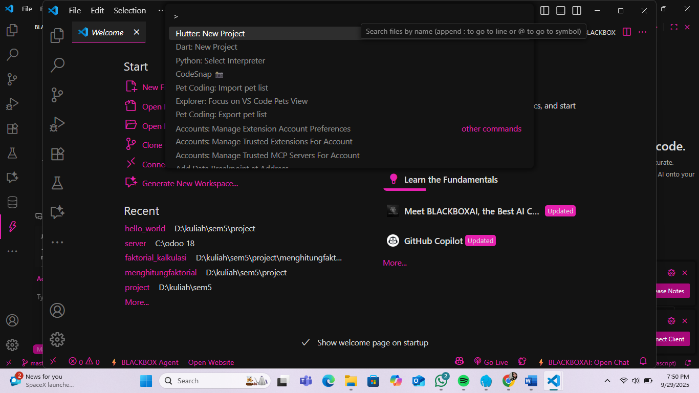

2.	Berikutnya, pilih Application lalu folder tempat proyek akan dibuat. Folder ini dapat berupa direktori utama Anda, atau direktori seperti C:\src\.
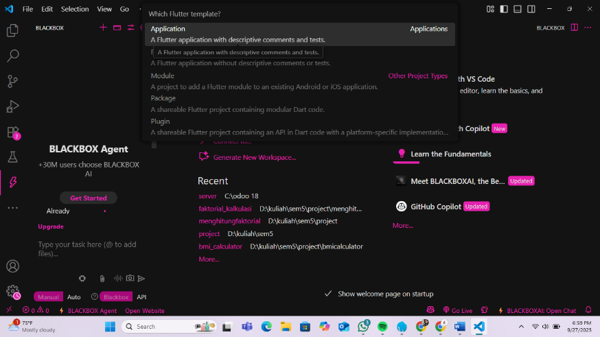

3.	Terakhir, beri nama proyek Anda. Beri nama seperti namer_app atau my_awesome_namer.
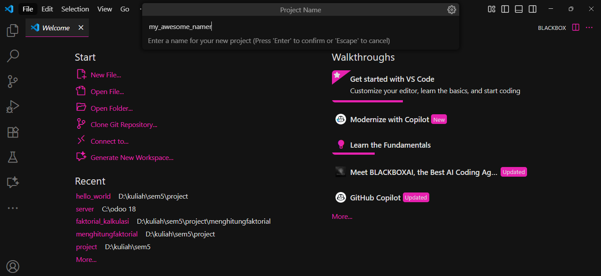

4.	Pada panel sebelah kiri VS Code, pastikan bahwa Penjelajah dipilih lalu buka file pubspec.yaml.

5.	Ganti konten file ini dengan kode berikut: pubspec.yaml
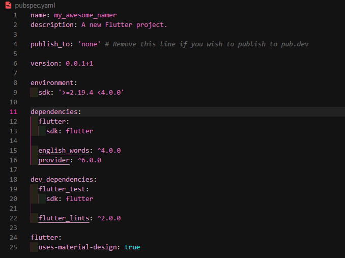

6.	Berikutnya, buka file konfigurasi lainnya dalam proyek tersebut, analysis_options.yaml.
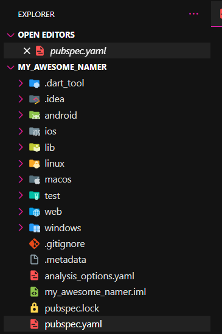

7.	Ganti konten file tersebut dengan kode berikut:
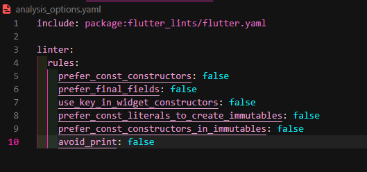

8.	Terakhir, buka file main.dart pada direktori lib/.
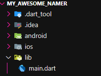

9.	Ganti konten file ini dengan kode berikut:
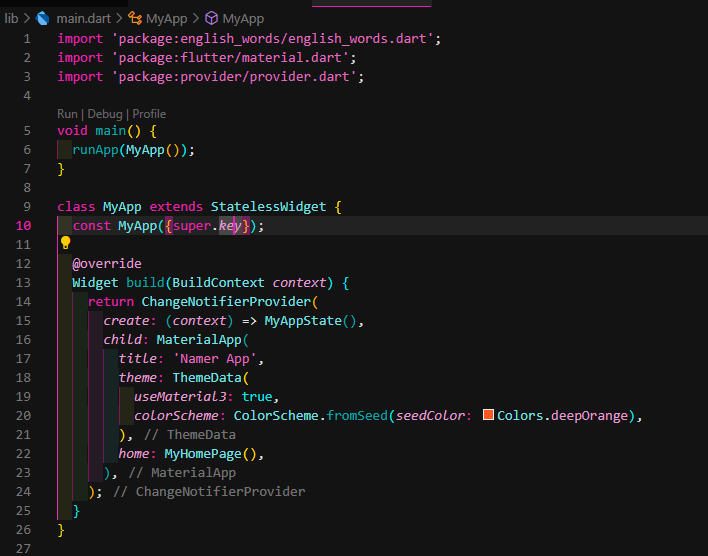
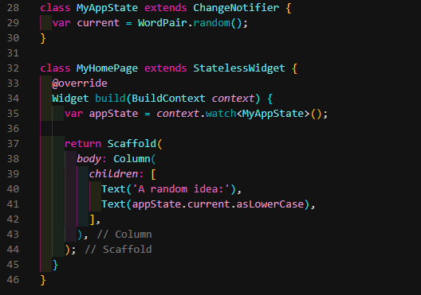

================

Bagian 2 : menambahkan tombol 
1.	Pertama, buka lib/main.dart dan pastikan Anda memilih perangkat target. Di bagian pojok kanan bawah VS Code, Anda akan menemukan tombol yang menampilkan perangkat target saat ini. Klik tombol untuk mengubahnya.
2.	Selagi lib/main.dart terbuka, temukan tombol "play"  di pojok kanan atas jendela VS Code lalu klik tombol tersebut.
3.	Setelah beberapa saat, aplikasi Anda diluncurkan dalam mode debug. Tampilannya masih terlihat biasa saja:
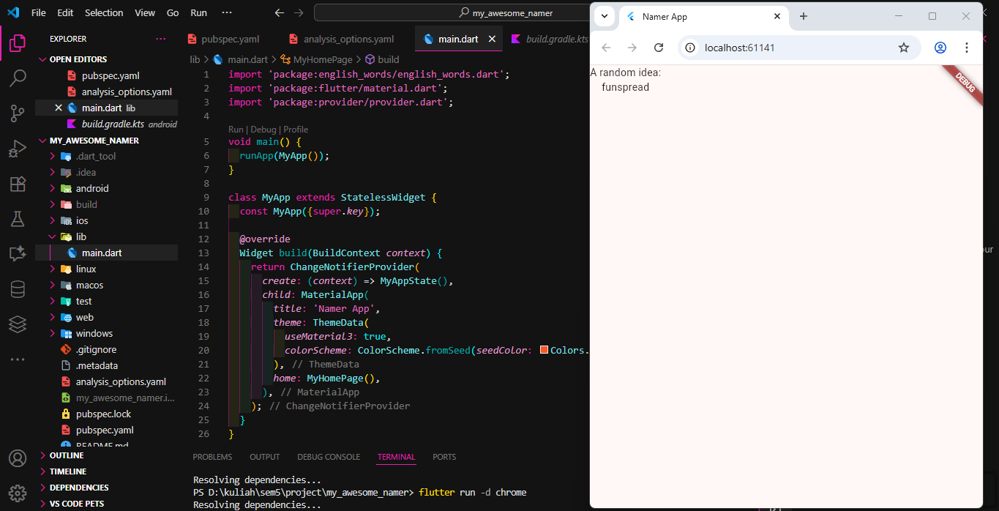

4.	Di bagian bawah lib/main.dart, tambahkan sesuatu pada string di objek Text pertama, dan simpan file tersebut (dengan Ctrl+S atau Cmd+S). Misalnya:

5.	Perhatikan bagaimana aplikasi segera berubah tetapi kata yang acak tetap sama. Situasi ini menunjukkan fitur stateful Hot Reload Flutter terkenal yang sedang bekerja. Hot reload dipicu saat Anda menyimpan perubahan untuk file sumber.
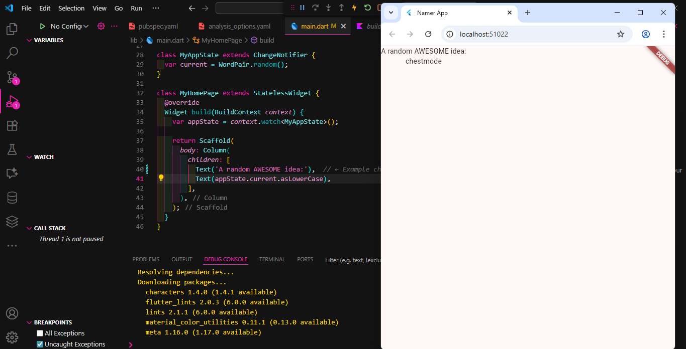

6.	Berikutnya, tambahkan tombol di bagian bawah Column, tepat di bawah instance Text kedua.
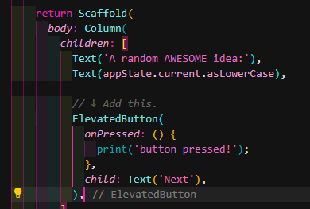

7.	Saat Anda menyimpan perubahan, aplikasi diperbarui kembali: Sebuah tombol muncul dan, saat Anda mengklik tombol tersebut, Konsol Debug di VS Code menampilkan pesan button pressed!.
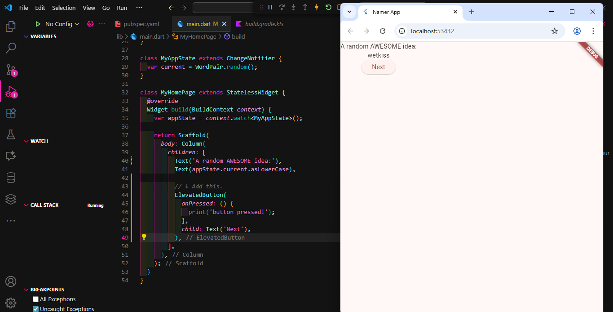

8.	Meskipun menyenangkan melihat Konsol Debug, Anda ingin tombol tersebut melakukan sesuatu yang lebih berguna. Namun, sebelum mencapai ke sana, perhatikan kode pada lib/main.dart lebih dekat, untuk memahami cara kerjanya.
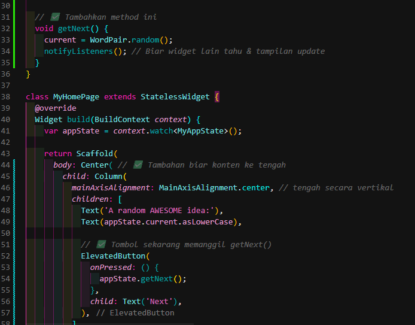
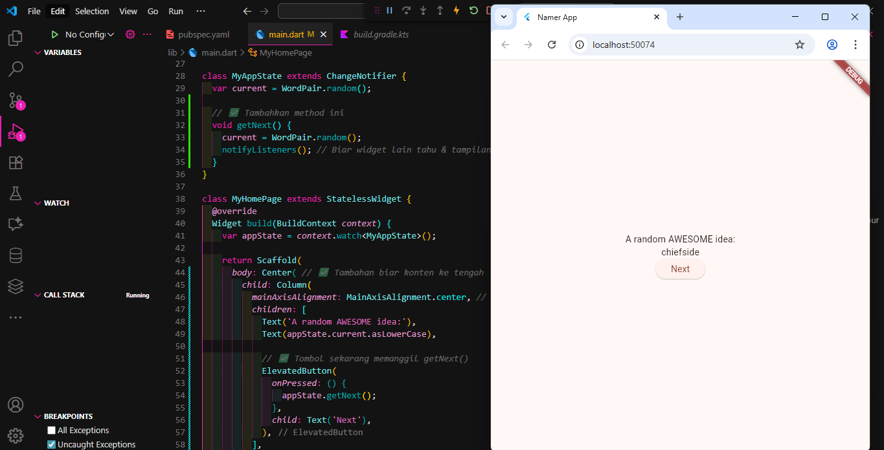

=====================================================================================================

Bagian 3 : 
1.	Gambar berikut menunjukkan tampilan aplikasi saat ini.
2.	Oleh karena itu, tulis ulang widget MyHomePage sebagai berikut:
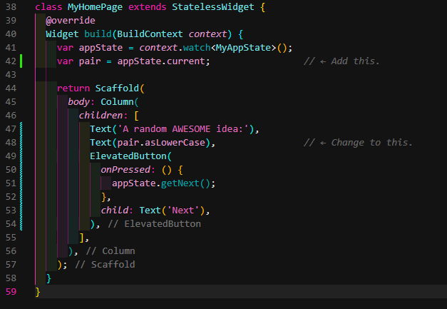

3.	Sekarang, panggil menu Refactor. Pada VS Code, Anda melakukan ini melalui salah satu dari dua cara:
Klik kanan potongan kode yang ingin Anda faktorkan ulang (dalam hal ini Text) dan pilih Refactor... dari menu drop-down,
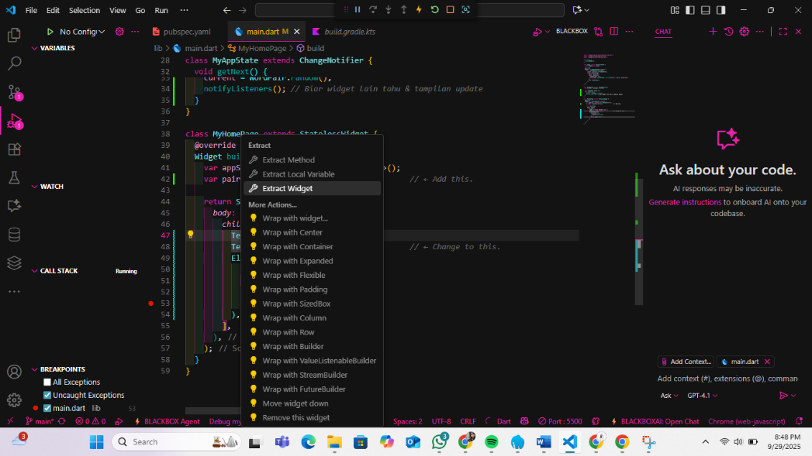

4.	Pada menu Refactor, pilih Extract Widget. Tetapkan nama, seperti BigCard, lalu klik Enter.
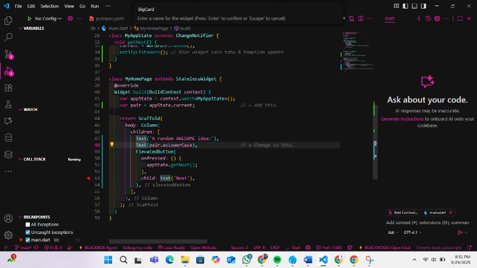

5.	Tindakan ini secara otomatis membuat class baru, BigCard, di akhir file saat ini. Class tersebut akan terlihat seperti berikut:
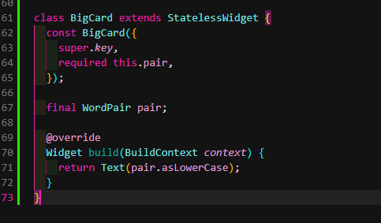

6.	Temukan class BigCard dan metode build() yang berada di dalamnya. Sama seperti sebelumnya, panggil menu Refactor pada widget Text. Namun, kali ini Anda tidak akan mengekstrak widget.
7.	Sebagai gantinya, pilih Wrap with Padding. Tindakan ini menciptakan widget induk baru di sekitar widget Text bernama Padding. Setelah menyimpannya, Anda akan melihat bahwa kata acak tersebut telah memiliki ruang yang lebih luas.
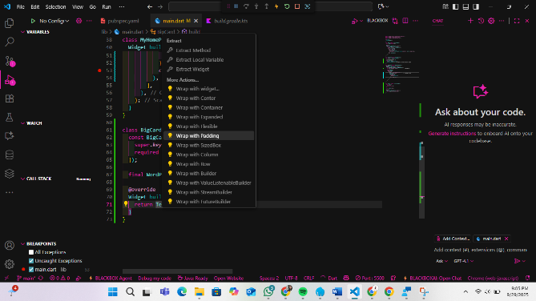

8.	Tingkatkan padding dari nilai default 8.0. Misalnya, gunakan 20 untuk padding yang lebih luas.
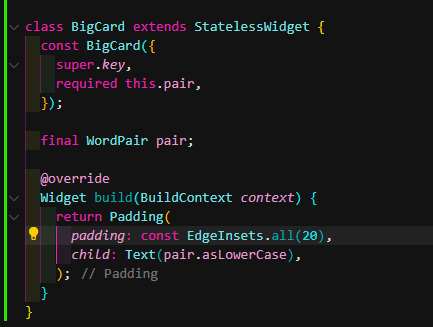

9.	Berikutnya, mari kita naik satu tingkat lebih tinggi. Tempatkan kursor Anda pada widget Padding, buka menu Refactor, lalu pilih Wrap with widget....
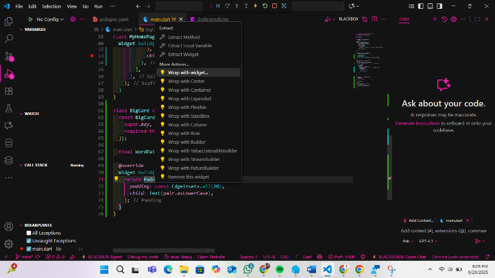

10.	Tindakan ini memungkinkan Anda untuk menentukan widget induk. Ketik "Card" dan tekan Enter.
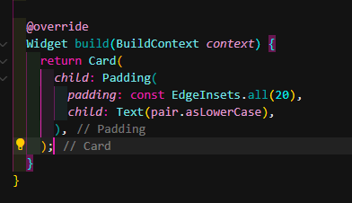
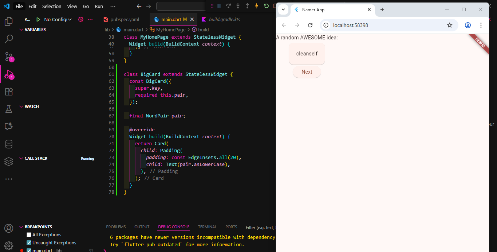

11.	Untuk membuat kartu menjadi lebih menarik, beri warna yang lebih kaya pada kartu tersebut. Karena ada baiknya untuk menjaga skema warna yang konsisten, gunakan Theme aplikasi untuk memilih warna. Buat perubahan berikut untuk metode build() BigCard.
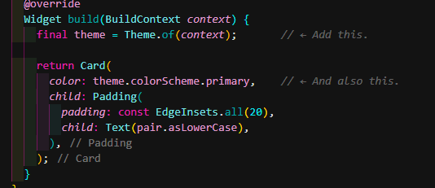
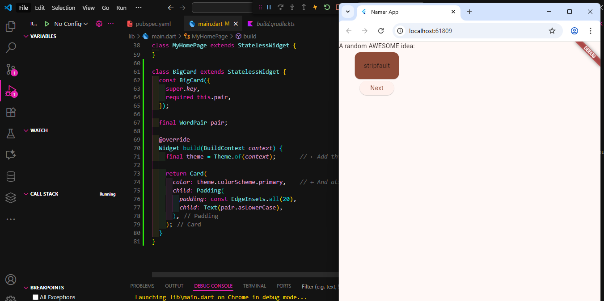

12.	Anda dapat mengubah warna ini serta skema warna keseluruhan aplikasi dengan men-scroll ke atas ke MyApp dan mengubah warna seed untuk ColorScheme di sana.
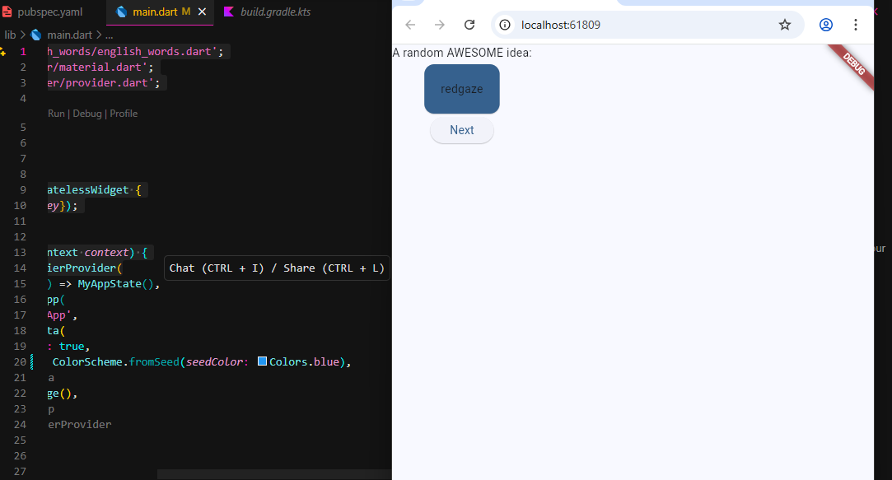

13.	Kartu tersebut masih memiliki masalah: ukuran teks terlalu kecil dan warnanya membuat teks sulit dibaca. Untuk memperbaiki masalah ini, buat perubahan berikut pada metode build() BigCard.
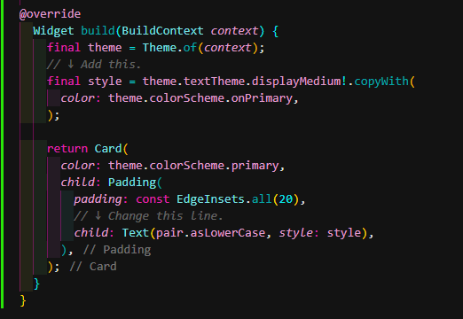
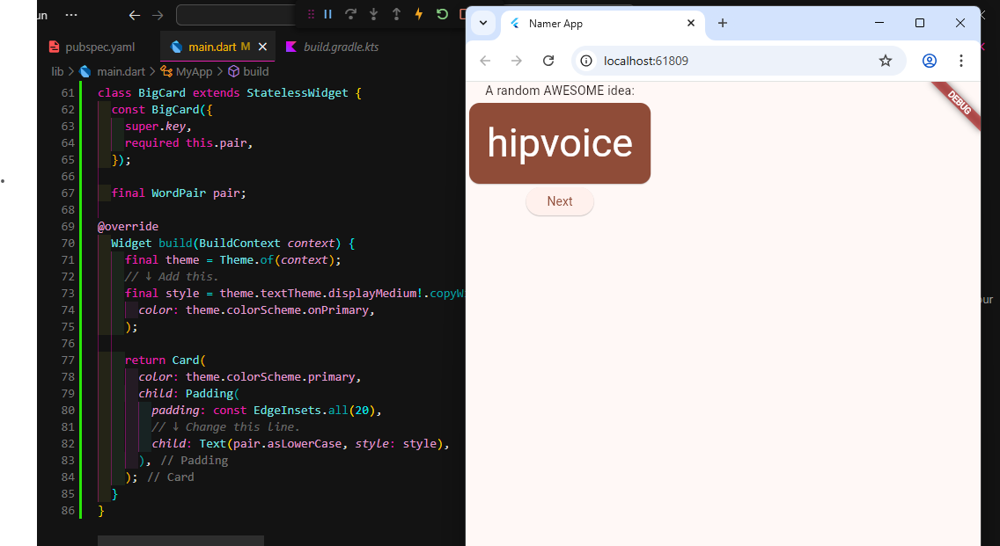

14.	Anda mungkin ingin mempertahankan kesederhanaan visual pair.asLowerCase. Gunakan properti semanticsLabel Text untuk mengganti konten visual widget teks dengan konten semantik yang lebih sesuai untuk pembaca layar:
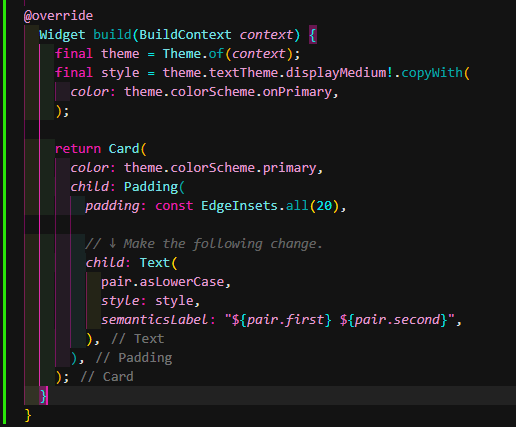
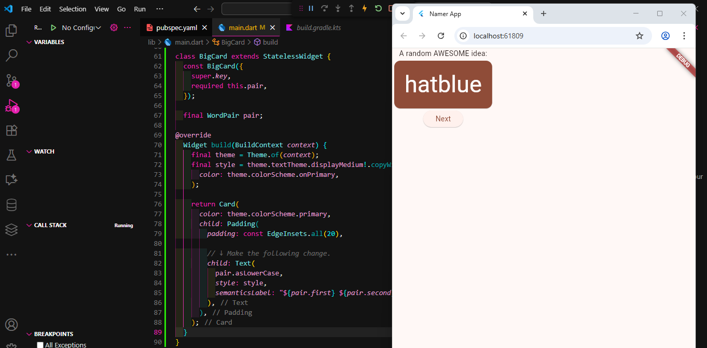

15.	Pertama, ingatlah bahwa BigCard adalah bagian dari Column. Secara default, kolom menggabungkan turunan kolom di bagian atas, tetapi kita dapat mengganti ini dengan mudah. Buka metode build() MyHomePage, dan buat perubahan berikut:
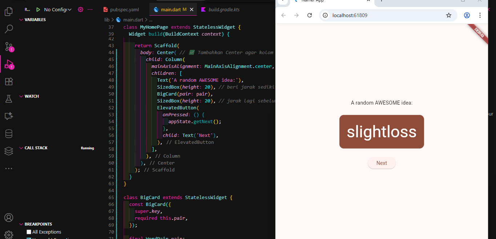

16.	Anda dapat menempatkan kolom itu sendiri di tengah. Letakkan kursor Anda di Column, buka menu Refactor (dengan Ctrl+. atau Cmd+.), lalu pilih Wrap with Center.
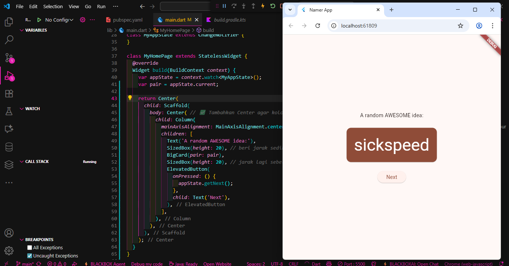

=====================================================================================================

Bagian 4 : menambahkan fungsi
Menambahkan logika bisnis
1.	Scroll ke MyAppState dan tambahkan kode berikut:
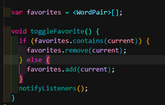
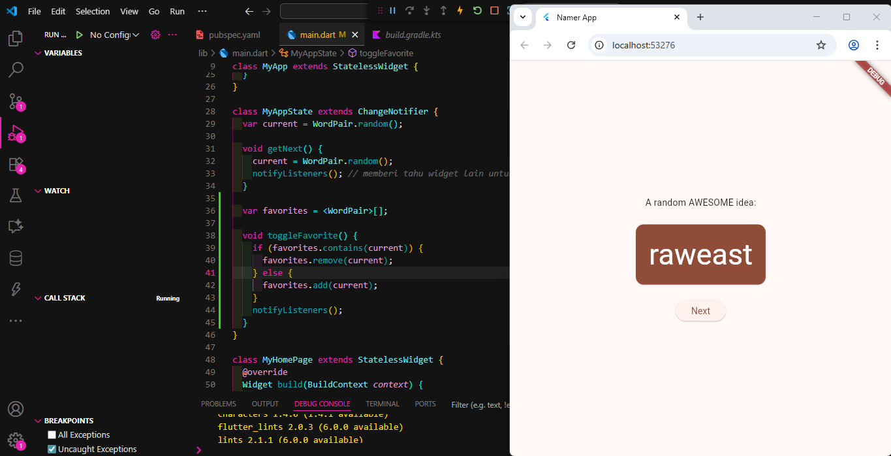

-----------------------------------------------------------------------------------------------------

Menambahkan tombol
1.	Dengan terselesaikannya "logika bisnis", saatnya untuk mengerjakan antarmuka pengguna kembali. Meletakkan tombol ‘Like' di sebelah kiri tombol ‘Next' memerlukan Row. Widget Row adalah padanan horizontal dari Column, yang telah Anda lihat sebelumnya.
2.	Pertama, gabungkan tombol yang ada pada Row. Buka metode build() MyHomePage, letakkan kursor pada ElevatedButton, buka menu Refactor dengan Ctrl+. atau Cmd+., lalu pilih Wrap with Row.
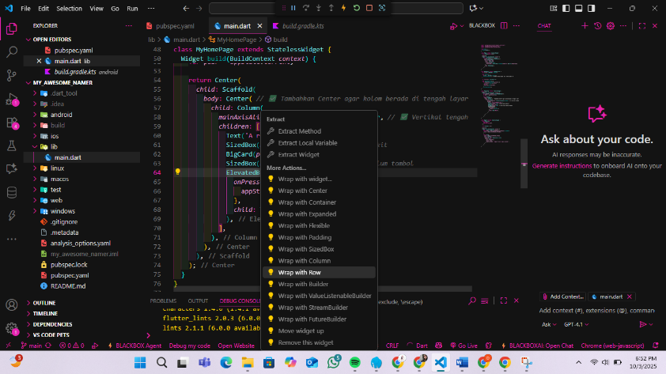
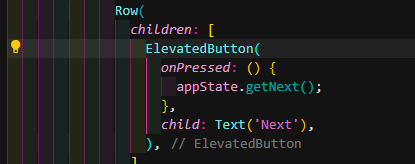

3.	Buat perubahan berikut:
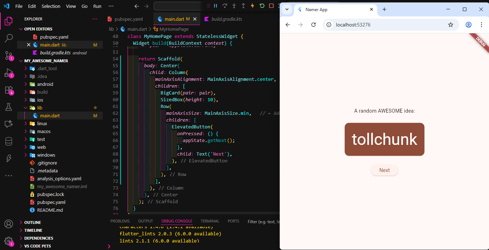

4.	Berikutnya, tambahkan tombol Like dan hubungkan ke toggleFavorite(). Sebagai tantangan, coba lakukan sendiri untuk pertama kali, tanpa melihat blok kode di bawah.
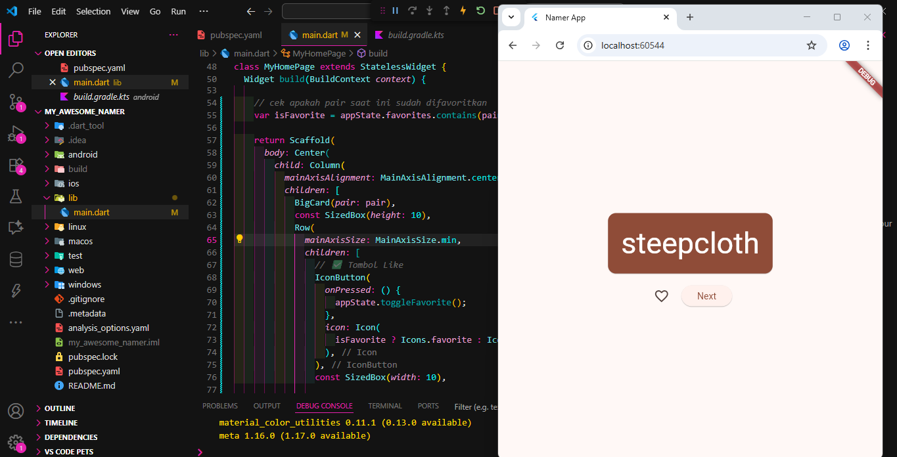

5.	Berikut satu cara untuk menambahkan tombol kedua untuk MyHomePage. Kali ini, gunakan konstruktor ElevatedButton.icon() untuk membuat tombol dengan ikon. Di bagian atas metode build, pilih ikon yang sesuai tergantung pada apakah pasangan kata saat ini sudah berada di favorit atau tidak. Selain itu, perhatikan penggunaan SizedBox lagi, untuk menjaga jarak antara kedua tombol.
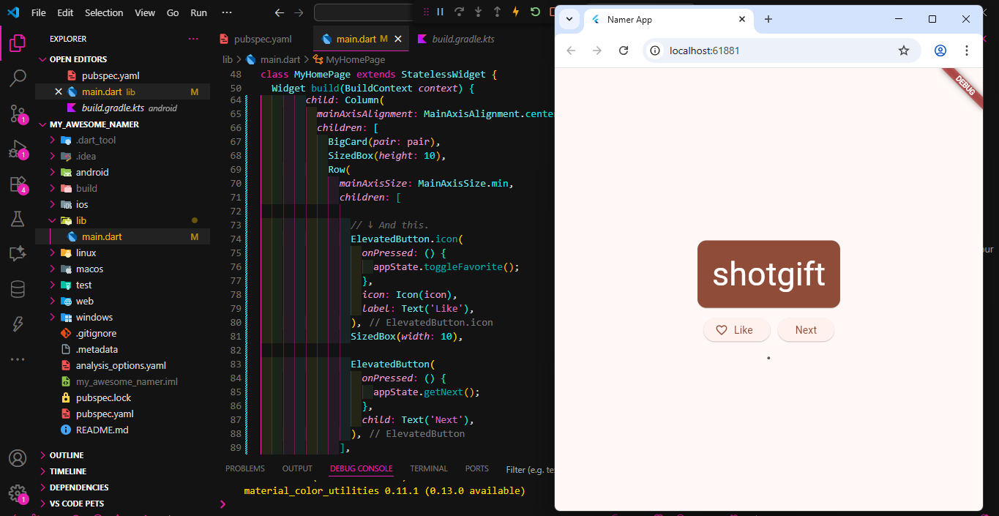

=====================================================================================================

Bagian 5 : Menambahkan kolom samping navigasi
1.	pisahkan MyHomePage menjadi 2 widget terpisah. Pilih keseluruhan MyHomePage, hapus, dan gantikan dengan kode berikut:
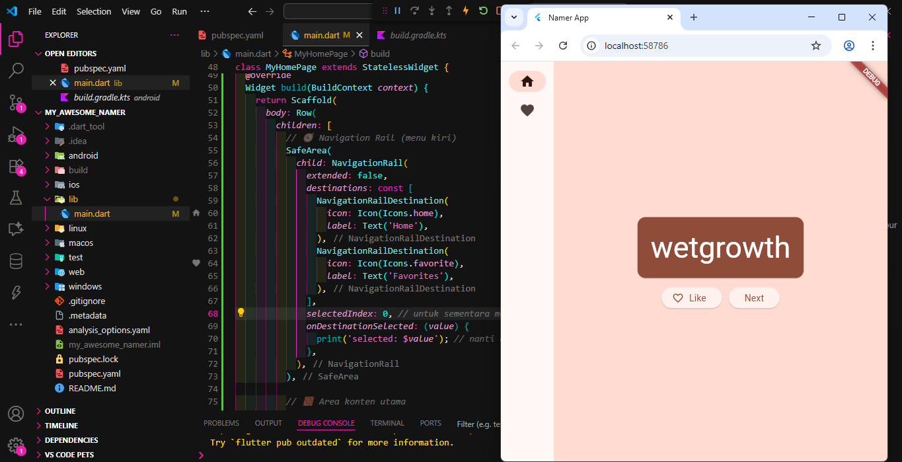
-----------------------------------------------------------------------------------------------------

Widget stateless versus stateful
1.	Tempatkan kursor Anda di baris pertama MyHomePage (baris yang diawali dengan class MyHomePage...), lalu buka menu Refactor menggunakan Ctrl+. atau Cmd+.. Kemudian, pilih Convert to StatefulWidget.
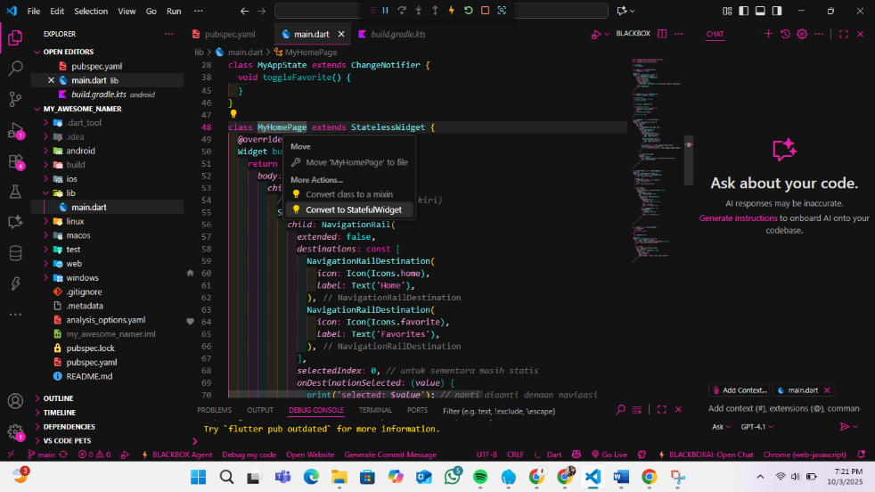
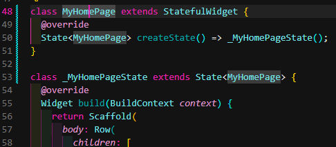
-----------------------------------------------------------------------------------------------------

setState
1.	Widget stateful baru hanya perlu melacak satu variabel: selectedIndex. Buat 3 perubahan berikut untuk _MyHomePageState:
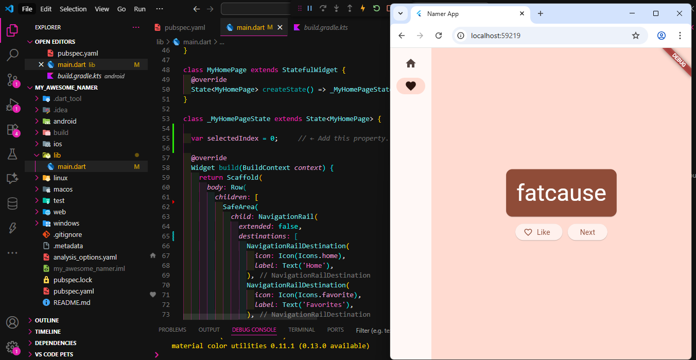

-----------------------------------------------------------------------------------------------------

Menggunakan selectedIndex
1.	Tempatkan kode berikut di bagian atas metode build _MyHomePageState, tepat sebelum return Scaffold:
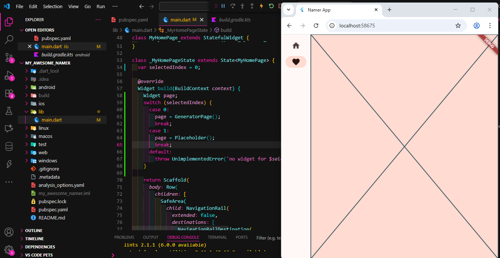
2.	Berikut tampilan _MyHomePageState setelah satu perubahan tersebut:
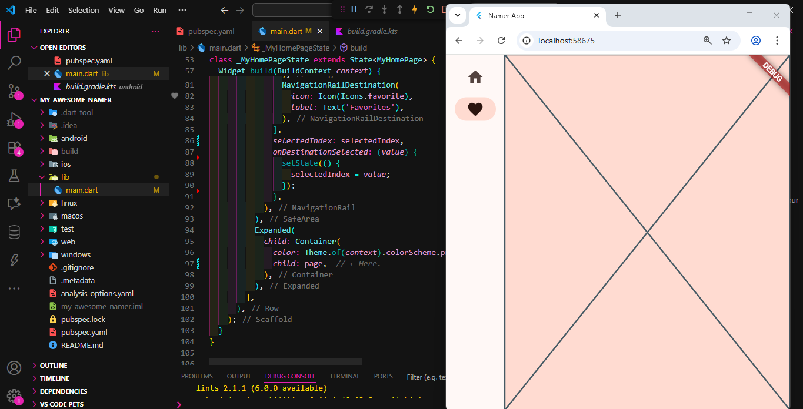

3.	Sekali lagi, gunakan menu Refactor Flutter di VS Code untuk membuat perubahan yang diperlukan. Namun, proses kali ini sedikit lebih rumit:
•	Dalam metode build _MyHomePageState, letakkan kursor Anda pada Scaffold.
•	Buka menu Refactor dengan Ctrl+. (Windows/Linux) atau Cmd+. (Mac).
•	Pilih Wrap with Builder dan tekan Enter.
•	Modifikasi nama Builder yang baru ditambahkan menjadi LayoutBuilder.
•	Modifikasi daftar parameter callback dari (context) menjadi (context, constraints).
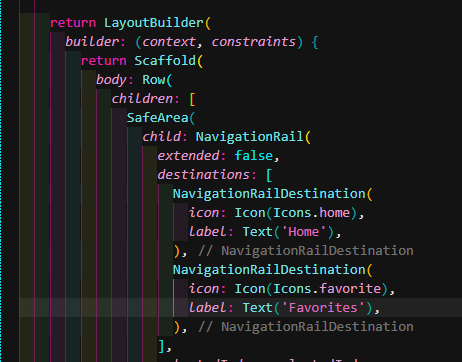

4.	Buat perubahan baris tunggal berikut untuk metode build _MyHomePageState:
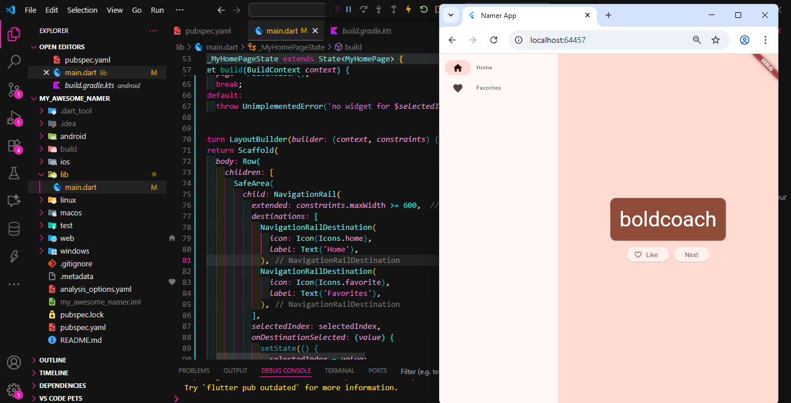

=====================================================================================================

Bagian 6 : Menambahkan halaman baru
1.	Berikut ini hanyalah salah satu cara untuk menerapkan halaman favorit. Bagaimana halaman ini diterapkan (semoga) akan menginspirasi Anda untuk bermain dengan kode—meningkatkan UI dan membuat UI sesuai keinginan Anda. Berikut class FavoritesPage baru:
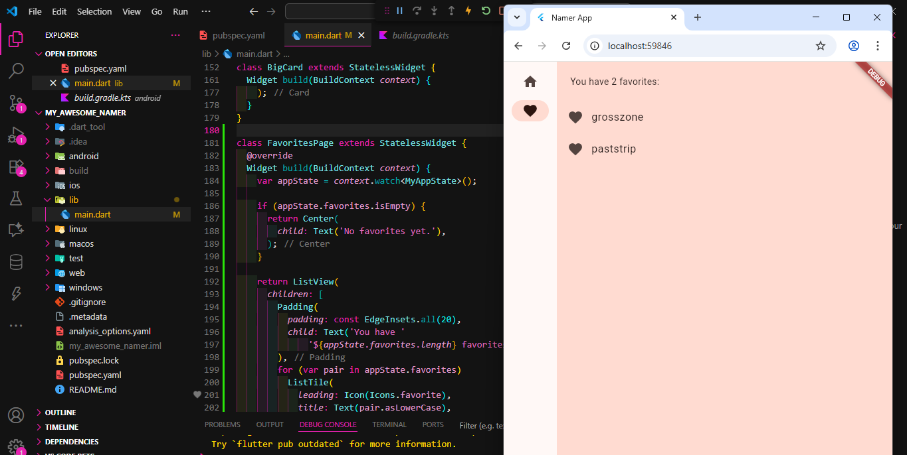